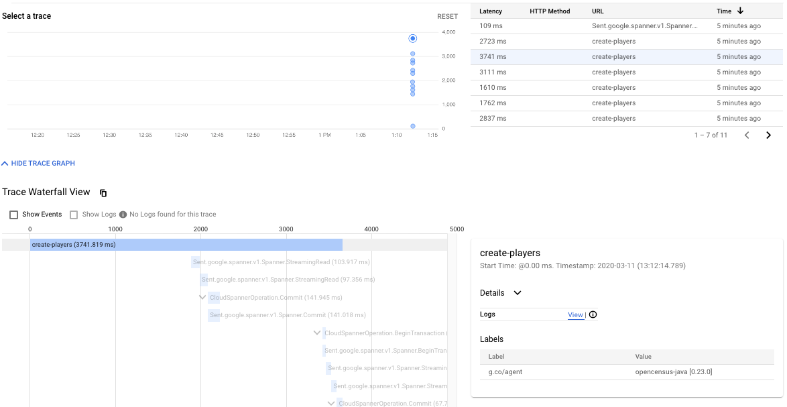

# Spanner read write transaction demo
To compile and run the program use the following:
Create a table in spanner 
```sql
    NumberRange(
        Next INT64 NOT NULL, 
        Value INT64 NOT NULL)
```
For running the program use the following command

Atomic transaction demo run:
```sh
mvn clean compile exec:java -Dexec.mainClass=com.example.spanner.ReadWriteTransactionMultiThreadTest \ 
-Dexec.args="demo test atomic 10" -Dexec.cleanupDaemonThreads=false
```
Non-atomic transaction demo run:

```sh
mvn clean compile exec:java -Dexec.mainClass=com.example.spanner.ReadWriteTransactionMultiThreadTest \ 
-Dexec.args="demo test nonatomic 10" -Dexec.cleanupDaemonThreads=false
```

##Results are shown as:

### Atomic test
```sh
In atomic update routine.
In atomic update routine.
In atomic update routine.
In atomic update routine.
In atomic update routine.
In atomic update routine.
In atomic update routine.
In atomic update routine.
In atomic update routine.
In atomic update routine.
Updating value to : 1
Updating value to : 1
Updating value to : 1
Updating value to : 1
Updating value to : 1
Updating value to : 2
Updating value to : 2
Updating value to : 3
Updating value to : 4
Updating value to : 4
Updating value to : 5
Updating value to : 6
Updating value to : 7
Updating value to : 8
Updating value to : 8
Updating value to : 9
Updating value to : 10

Value after the update : 10
```
### Non-atomic test
```sh
In non-atomic update routine.
In non-atomic update routine.
In non-atomic update routine.
In non-atomic update routine.
In non-atomic update routine.
In non-atomic update routine.
In non-atomic update routine.
In non-atomic update routine.
In non-atomic update routine.
In non-atomic update routine.
Updating value to : 1
Updating value to : 1
Updating value to : 1
Updating value to : 2
Updating value to : 2
Updating value to : 2
Updating value to : 3
Updating value to : 4
Updating value to : 5
Updating value to : 5

Value after the update : 5
```
As you saw during the non-atomic run values are overwritten by some of the threads.

Opencensus tracing is also enabled in the project. So you could go to stackdriver tracing to see the tracing examples.


 
